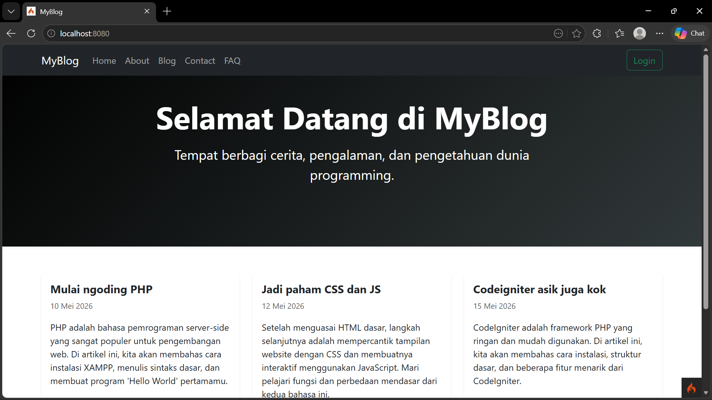
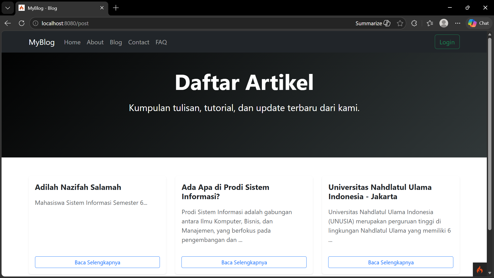
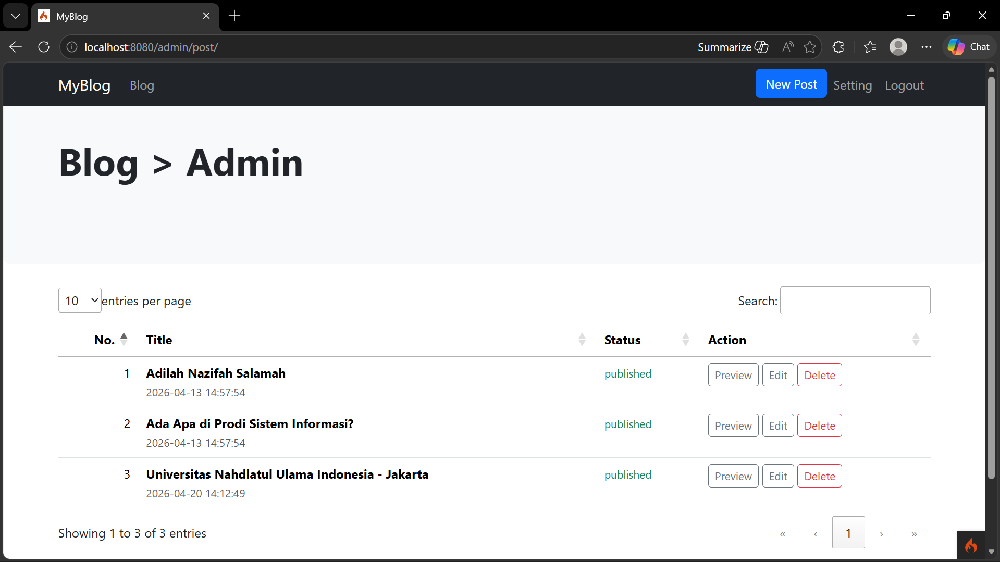
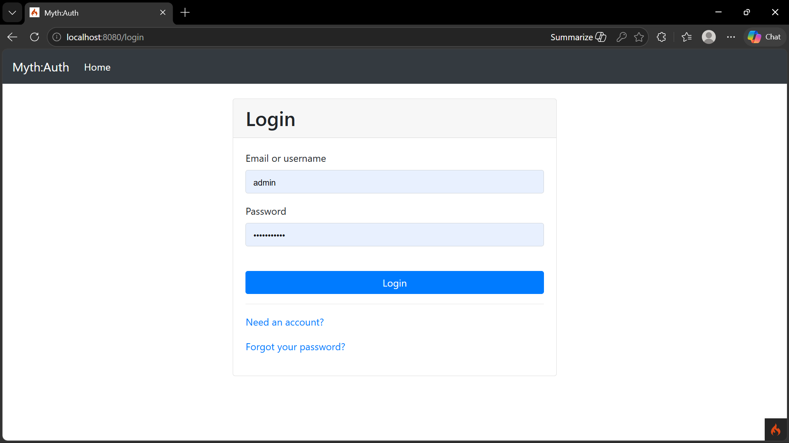
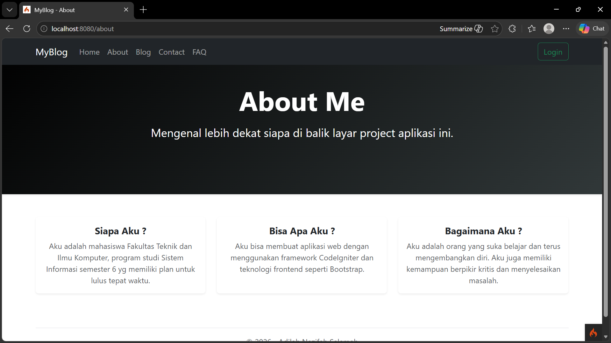
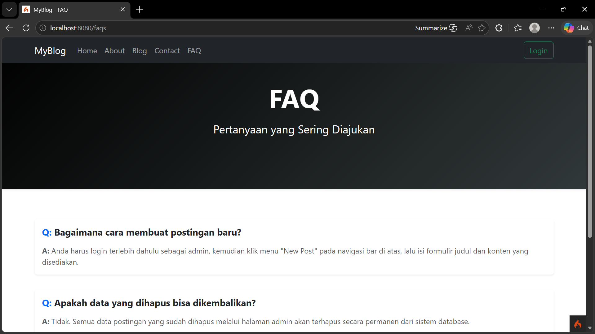
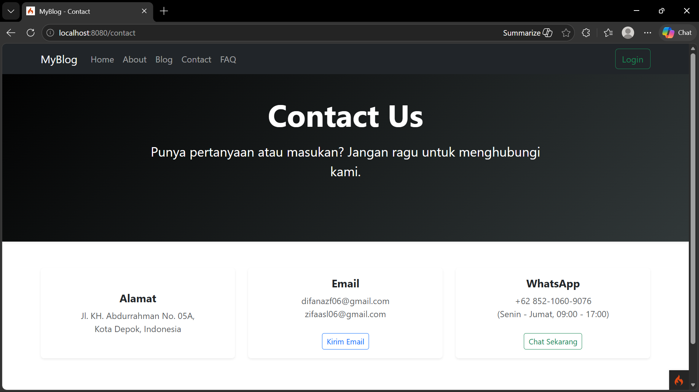

# MyBlog - Project Aplikasi Web

Aplikasi blog yang dikembangkan menggunakan framework CodeIgniter 4. Aplikasi ini dilengkapi dengan fitur manajemen artikel, profil, kontak, dan dasbor admin.

## 📸 Tampilan Aplikasi

**1. Halaman Utama (Home)**

**2. Halaman Daftar Artikel (Blog)**

**3. Halaman Dasbor Admin**

**4. Halaman Login**

**5. Halaman About & FAQ**

**6. Halaman Contact**

---

## 🚀 Fitur Utama
- Sistem Autentikasi (Login/Logout)
- CRUD (Create, Read, Update, Delete) Artikel Blog
- Tampilan antarmuka yang bersih dan responsif

---
## Installation & updates

`composer create-project codeigniter4/appstarter` then `composer update` whenever
there is a new release of the framework.

When updating, check the release notes to see if there are any changes you might need to apply
to your `app` folder. The affected files can be copied or merged from
`vendor/codeigniter4/framework/app`.

## Setup

Copy `env` to `.env` and tailor for your app, specifically the baseURL
and any database settings.

## Important Change with index.php

`index.php` is no longer in the root of the project! It has been moved inside the *public* folder,
for better security and separation of components.

This means that you should configure your web server to "point" to your project's *public* folder, and
not to the project root. A better practice would be to configure a virtual host to point there. A poor practice would be to point your web server to the project root and expect to enter *public/...*, as the rest of your logic and the
framework are exposed.

**Please** read the user guide for a better explanation of how CI4 works!

## Repository Management

We use GitHub issues, in our main repository, to track **BUGS** and to track approved **DEVELOPMENT** work packages.
We use our [forum](http://forum.codeigniter.com) to provide SUPPORT and to discuss
FEATURE REQUESTS.

This repository is a "distribution" one, built by our release preparation script.
Problems with it can be raised on our forum, or as issues in the main repository.

## Server Requirements

PHP version 8.2 or higher is required, with the following extensions installed:

- [intl](http://php.net/manual/en/intl.requirements.php)
- [mbstring](http://php.net/manual/en/mbstring.installation.php)

> [!WARNING]
> - The end of life date for PHP 7.4 was November 28, 2022.
> - The end of life date for PHP 8.0 was November 26, 2023.
> - The end of life date for PHP 8.1 was December 31, 2025.
> - If you are still using below PHP 8.2, you should upgrade immediately.
> - The end of life date for PHP 8.2 will be December 31, 2026.

Additionally, make sure that the following extensions are enabled in your PHP:

- json (enabled by default - don't turn it off)
- [mysqlnd](http://php.net/manual/en/mysqlnd.install.php) if you plan to use MySQL
- [libcurl](http://php.net/manual/en/curl.requirements.php) if you plan to use the HTTP\CURLRequest library
